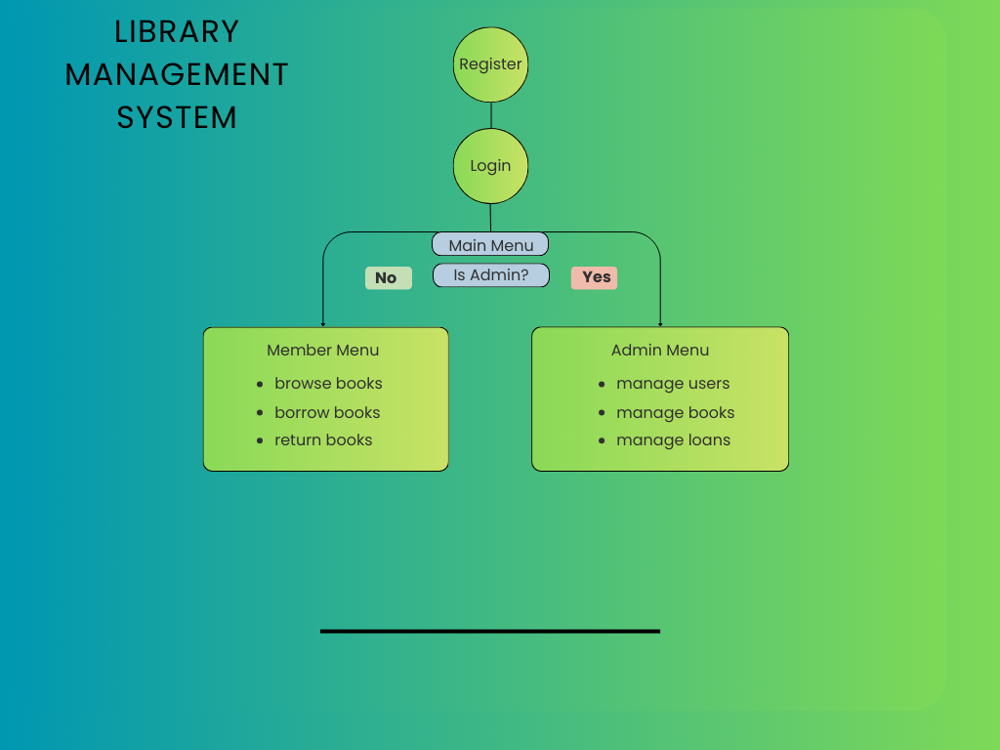
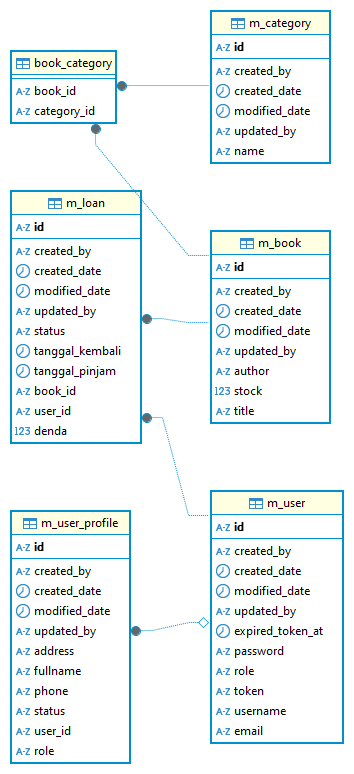

# Library Management System

Library Management System adalah aplikasi berbasis Spring Boot 3 dengan PostgreSQL sebagai database utama. Aplikasi ini sudah mendukung JWT Authentication untuk proses login, dilengkapi dengan role-based access (Admin dan Member), serta menerapkan security, validasi data, dan unit test untuk menjaga keamanan serta kualitas aplikasi.

## Teknologi & Dependencies

- **Java 21**
- **Spring Boot 3.5.5**
- **Maven 3.6+**
- **Spring Web, Spring Data JPA, Spring Security, Validation**
- **PostgreSQL Driver**
- **Lombok**
- **JWT (jjwt-api, jjwt-impl, jjwt-jackson)**
- **SpringDoc OpenAPI (Swagger UI)**
- **Commons Lang3**
- **JUnit 5 & Mockito**

## Dokumentasi API
 
- **Swagger UI**: [http://localhost:8080/swagger-ui/index.html](http://localhost:8080/swagger-ui/index.html)

## User Akses untuk Testing

Aplikasi sudah menyediakan akun default untuk setiap role, yang bisa digunakan saat uji coba:

### Admin

```json
{
  "username": "admin1",
  "password": "admin123"
}
```

### Member

```json
{
  "username": "member1",
  "password": "member123"
}
```

## 📊 Flowchart Sistem




## Fitur

### Authentication & Authorization

- Login menggunakan JWT
- Hak akses berdasarkan role (Admin, Member)

### Admin

- Mengelola user member (CRUD)
- Mengelola buku (CRUD)
- Mengelola profile user (CRUD)
- Melihat seluruh peminjaman buku
- Mengelola pengembalian buku

### Member

- Meminjam buku
- Melihat riwayat peminjaman
- Mengelola profile pribadi

## Konfigurasi Database

Aplikasi menggunakan PostgreSQL. Untuk development, konfigurasi database dapat ditemukan di:

`src/main/resources/profile/development/application.yml`

```yaml
spring:
  datasource:
    url: jdbc:postgresql://localhost:5432/LibraryManagementSystem
    username: postgres
    password: postgres
```

## Instalasi & Menjalankan Aplikasi

### Prerequisites

- Java 21
- Maven 3.6+
- PostgreSQL

### Langkah Instalasi

1. **Clone repository**

   ```bash
   git clone https://github.com/Dikin19/library-management-system.git
   cd aplikasi.book.management
   ```

2. **Setup Database**

   - Pastikan PostgreSQL sudah terinstall dan berjalan
   - Buat database baru dengan nama `LibraryManagementSystem`

   ```sql
   CREATE DATABASE LibraryManagementSystem;
   ```

3. **Konfigurasi Database**

   - Update konfigurasi database di `src/main/resources/profile/development/application.yml`
   - Sesuaikan username dan password PostgreSQL

4. **Install Dependencies**

   ```bash
   mvn clean install
   ```

5. **Jalankan Aplikasi**

   ```bash
   mvn spring-boot:run
   ```

6. **Akses Aplikasi**
   - API Base URL: `http://localhost:8080`
   - Swagger UI: `http://localhost:8080/swagger-ui/index.html`


## Configuration Databse BY PostgreSQL



## Profile Environment

Aplikasi mendukung multiple environment:

- **Development**: `src/main/resources/profile/development/`
- **Staging**: `src/main/resources/profile/staging/`
- **Production**: `src/main/resources/profile/production/`

Untuk menjalankan dengan profile tertentu:

```bash
mvn spring-boot:run -Dspring-boot.run.profiles=staging
```

## Endpoint API

### Authentication

- `POST /auth/register` - Register user baru
- `POST /auth/login` - Login user
- `GET /auth/logout` - Logout user

### Admin Management (Admin Only)

- `POST /admin/update` - Update user
- `GET /admin/find-all` - Get semua user
- `GET /admin/find-by-id/{id}` - Get user by ID
- `DELETE /admin/delete/{id}` - Delete user

### Book Management (Admin Only)

- `POST /book/create` - Tambah buku baru
- `PUT /book/update` - Update buku
- `GET /book/find-all` - Get semua buku (Public)
- `GET /book/find-by-id/{id}` - Get buku by ID (Public)
- `DELETE /book/delete/{id}` - Delete buku

### Loan Management

- `POST /loan/pinjam-buku` - Pinjam buku (Public)
- `POST /loan/kembalikan-buku/{loanId}` - Kembalikan buku (Admin Only)
- `GET /loan/find-all` - Get semua peminjaman (Admin Only)

### Profile Management

- `POST /profile/create` - Buat profile baru
- `POST /profile/update` - Update profile
- `GET /profile/find-all` - Get semua profile
- `GET /profile/find-by-id/{id}` - Get profile by ID
- `DELETE /profile/delete/{id}` - Delete profile

## Security Features

- **JWT Authentication**: Token-based authentication dengan expired time 1 jam
- **Role-based Authorization**: Menggunakan `@PreAuthorize` annotation
- **Password Encryption**: BCrypt password encoding
- **Input Validation**: Bean validation untuk request validation
- **CORS Configuration**: Configured untuk cross-origin requests

## Logging

Aplikasi menggunakan Logback untuk logging dengan konfigurasi:

- **Development**: Console dan file logging
- **Production**: File logging dengan rotation

Log files location: `logs/`

## Troubleshooting

### Common Issues

1. **Database Connection Error**

   - Pastikan PostgreSQL service sudah berjalan
   - Periksa konfigurasi database di application.yml
   - Pastikan database sudah dibuat

2. **JWT Token Error**

   - Periksa apakah token masih valid (belum expired)
   - Pastikan format header Authorization: `Bearer <token>`

3. **Permission Denied**

   - Pastikan user memiliki role yang sesuai untuk mengakses endpoint
   - Periksa annotation `@PreAuthorize` pada controller


### Development Tips

- Gunakan Swagger UI untuk testing API
- Periksa log di `logs/` folder untuk debugging
- Gunakan profile development untuk debugging dengan show-sql: true
- Unit test harus pass sebelum commit code
